<h3 align="center">
  
</h3>

  
  
  

---

#### What I work in

---

#### PayneSDD — a spec-driven protocol for AI agents

*AI coding you don't re-read: the plan is agreed before code, "done" is machine-verified, and an independent skeptic tries to break every result.*

  

  
  

---

#### Reach me

